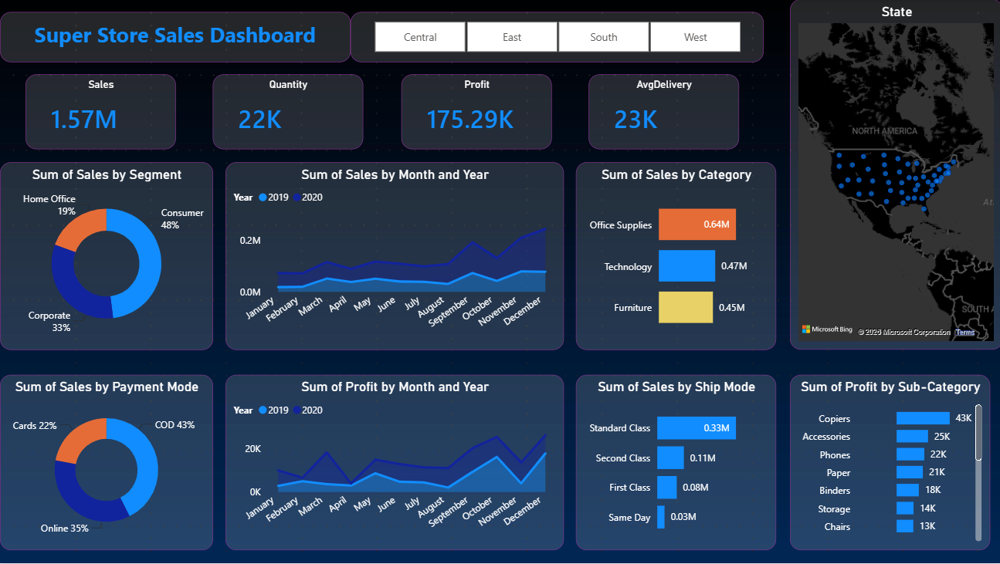

# 📊 Super Store Sales Dashboard

Interactive Power BI dashboard analysing **USD 1.57M in sales and 175K profit** across 4 regions, 3 product categories and 4 ship modes (2019-2020).

## Overview

The dashboard analyses sales performance by region, segment, category, ship mode and payment mode. It gives a quick view of key performance indicators and helps identify sales trends, profitable areas and customer behaviour patterns.

## Key Highlights

- KPI cards for Sales, Quantity, Profit and Average Delivery (days)
- Region filter buttons (Central, East, South, West)
- Monthly sales and profit trends, compared year by year
- Sales by segment (Consumer, Corporate, Home Office)
- Sales by category (Office Supplies, Technology, Furniture)
- Sales by payment mode (COD, Online, Cards)
- Sales by ship mode
- Profit by sub-category
- Map of sales by state

## Key Insights

- Sales grew 77% in 2020 (USD 565K to 1.00M), but profit grew only 14%, so margin fell from 14.5% to 9.3%.
- Technology had the best margin (19%); Furniture had the lowest (2%).
- Tables lost about USD 11K in profit; Copiers were the top profit sub-category (USD 43K).
- West had the highest margin (13%); Central had the lowest (8%).
- Consumer is 48% of sales, and COD is the most used payment mode (43%).
- Average delivery time is 3.9 days; Standard Class is the slowest at about 5 days.

## DAX Measures

| Measure | Purpose |
|---|---|
| Total Sales | Sum of sales |
| Total Profit | Sum of profit |
| Profit Margin % | Total Profit divided by Total Sales |
| Avg Delivery Days | Average days from order date to ship date |

## Data

5,900 order lines across 3,003 orders, from 1 January 2019 to 31 December 2020.

## Tools Used

- Power BI
- DAX
- Interactive visuals and filters

## Files

- `SalesDashboard.pbix`: Power BI report
- `SuperStoreDashboard.png`: dashboard screenshot
